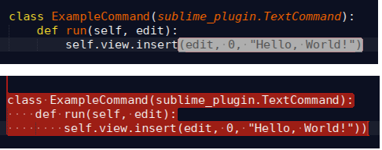

Bracket Flasher
===============

A Sublime Text 3 plugin that highlights matching brackets as you type, and
makes it obvious when you accidentally add an unmatched bracket.

Bracket Flasher makes it easy to see where your matching brackets are by
briefly highlighting the area of text enclosed by the bracket you have just
typed. Or if there is no matching bracket it will highlight the screen with
a warning to make it clear you've made a mistake.

## Installation
Install from Package Control in the usual way.

## Settings
See the default settings (Preferences->Package Settings->BracketFlasher->Settings - Default) for the list of settings.
You can adjust how and how long the screen flashes, and the sets of bracket pairs that are handled.
